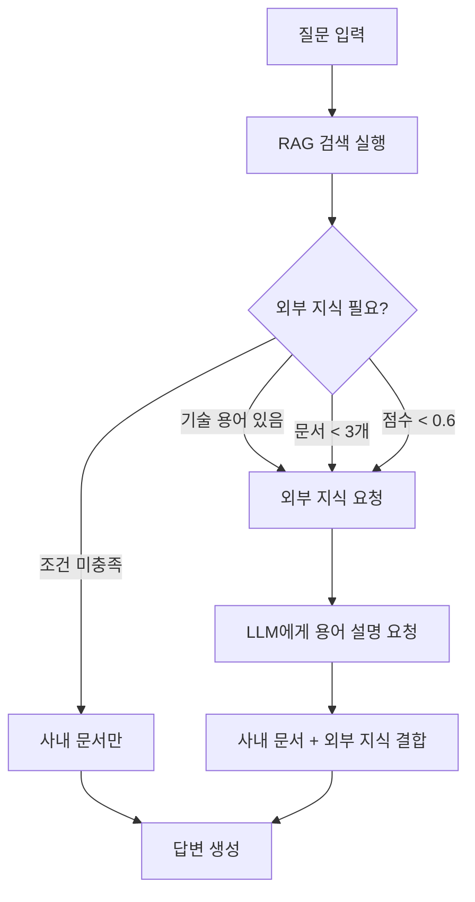

# 외부 지식 보강 기능 (External Knowledge Enrichment)

## 📌 개요

RAG 검색 결과에 **외부 기술 지식을 자동으로 보강**하여 답변 품질을 향상시키는 기능입니다.

### 해결하는 문제

❌ **기존 문제점**:
```
Q: "국민은행 SSO 연동 관련 일감 찾아줘"
A: REDMINE #133882 - [국민은행] SSO 연동방식 변경... (문서만 나열)
   → SSO가 뭔지 모르는 사용자에게는 불친절
```

✅ **개선 결과**:
```
Q: "국민은행 SSO 연동 관련 일감 찾아줘"
A:
📚 SSO(Single Sign-On)란?
   하나의 인증으로 여러 시스템에 접근할 수 있는 인증 방식...

📋 사내 관련 일감:
   1. REDMINE #133882 - [국민은행] SSO 연동방식 변경
   ...
```

---

## 🎯 주요 기능

### 1. 자동 기술 용어 탐지
질문에서 기술 용어를 자동으로 탐지합니다:
- SSO, API, OAuth, SAML, JWT
- REST, SOAP, VPN, SSL, TLS
- LDAP, AD, DNS, CDN, CI/CD
- HTTP, HTTPS, FTP, SMTP, TCP, UDP, IP

### 2. 외부 지식 보강 조건
다음 3가지 조건 중 하나라도 해당하면 외부 지식을 보강합니다:

1. **기술 용어 포함**: SSO, API 등 기술 용어가 질문에 있음
2. **문서 부족**: RAG에서 찾은 문서가 3개 미만
3. **관련도 낮음**: 평균 관련도 점수가 0.6 미만

### 3. 하이브리드 답변 생성
외부 지식 + 사내 문서를 결합하여 답변:
```
1. [기술 용어 설명] ← LLM 일반 지식
2. [사내 문서 정보] ← RAG 검색 결과 (메인)
3. [추가 참고 사항] ← 종합 정보
```

---

## 💡 작동 방식

### 실행 흐름



### 코드 구조

#### 1. 기술 용어 추출
```python
def _extract_technical_terms(self, question: str) -> List[str]:
    """질문에서 기술 용어 추출"""
    tech_terms = {'SSO', 'API', 'OAuth', 'SAML', 'JWT', ...}

    found_terms = []
    question_upper = question.upper()

    for term in tech_terms:
        if term in question_upper:
            found_terms.append(term)

    return found_terms
```

#### 2. 보강 필요 여부 판단
```python
def _should_enrich_with_external_knowledge(
    self,
    question: str,
    documents: List[Dict]
) -> bool:
    """외부 지식 보강 필요 여부 판단"""
    # 조건 1: 기술 용어 있음
    tech_terms = self._extract_technical_terms(question)
    if tech_terms:
        return True

    # 조건 2: 문서 부족
    if len(documents) < 3:
        return True

    # 조건 3: 낮은 관련도
    avg_score = sum(d.get('score', 0) for d in documents) / len(documents)
    if avg_score < 0.6:
        return True

    return False
```

#### 3. 외부 지식 가져오기
```python
def _get_external_knowledge(self, terms: List[str]) -> str:
    """LLM에게 기술 용어 설명 요청"""
    prompt = f"""다음 기술 용어들에 대해 간단하고 명확하게 설명해주세요.
각 용어당 2-3문장으로 핵심만 설명하세요.

용어: {', '.join(terms)}
"""

    response = self.client.chat.completions.create(
        model=self.model,
        messages=[{
            "role": "system",
            "content": "당신은 기술 용어를 쉽고 정확하게 설명하는 전문가입니다."
        }, {
            "role": "user",
            "content": prompt
        }],
        temperature=0.3,  # 일관된 설명
        max_tokens=500
    )

    return response.choices[0].message.content
```

#### 4. 하이브리드 프롬프트 생성
```python
# 외부 지식 추가 여부 확인
external_knowledge = ""
if self._should_enrich_with_external_knowledge(question, documents):
    tech_terms = self._extract_technical_terms(question)
    if tech_terms:
        external_knowledge = self._get_external_knowledge(tech_terms)

# 프롬프트 구성
user_prompt = f"""질문: {question}
"""
if external_knowledge:
    user_prompt += f"""
📚 기술 용어 설명 (참고):
{external_knowledge}

"""
user_prompt += f"""참고 문서 (사내):
{context}

위 정보들을 바탕으로 질문에 답변해주세요.
사내 문서를 중심으로 답변하되, 기술 용어 설명을 활용하여 더 이해하기 쉽게 설명해주세요."""
```

---

## 📊 테스트 결과

### 기능 테스트

```bash
$ python test_external_knowledge.py

🧪 Technical Term Extraction Test
✅ Question: 국민은행 SSO 연동 관련 일감 찾아줘
   Expected: ['SSO']
   Got: ['SSO']

✅ Question: API 호출 에러가 발생해요
   Expected: ['API']
   Got: ['API']

✅ Question: OAuth와 JWT 차이점이 뭐야?
   Expected: ['OAuth', 'JWT']
   Got: ['JWT', 'OAuth']

🧪 Enrichment Decision Test
✅ Technical term (SSO) - 기술 용어 감지로 보강
✅ Few documents (2) - 문서 부족으로 보강
✅ Low score (0.5) - 낮은 점수로 보강
✅ Good documents, no tech terms - 보강 불필요
```

### 실제 사용 예시

#### 예시 1: 기술 용어가 있는 경우

**입력**: "국민은행 SSO 연동 관련 일감 찾아줘"

**처리**:
1. 기술 용어 탐지: `['SSO']` ✅
2. 외부 지식 요청: SSO 개념 설명
3. RAG 검색: 4개 문서 발견
4. 하이브리드 답변 생성

**출력**:
```
📚 SSO(Single Sign-On)란?
SSO는 하나의 인증으로 여러 시스템에 접근할 수 있는 인증 방식입니다.
사용자가 한 번만 로그인하면 연동된 모든 서비스를 별도 로그인 없이
이용할 수 있습니다.

📋 사내 관련 일감:
1. REDMINE #133882 - [국민은행 - 내부직원원격] SSO 연동방식 변경
   - 프로젝트: [2021]RC6.0-Solution
   - 상태: 완료

2. REDMINE #123282 - [국민은행] 로그인시 계정정보 변경
   ...
```

#### 예시 2: 문서가 없는 경우

**입력**: "레드마인 SSO 연동 관련 일감 찾아줘"

**처리**:
1. 기술 용어 탐지: `['SSO']` ✅
2. 외부 지식 요청: SSO 개념 설명
3. RAG 검색: 0개 문서 발견 ⚠️
4. 외부 지식 중심 답변 생성

**출력**:
```
📚 SSO(Single Sign-On)란?
SSO는 하나의 인증으로 여러 시스템에 접근할 수 있는 인증 방식입니다.

❌ 사내 문서:
현재 "레드마인 SSO" 관련 일감을 찾지 못했습니다.

💡 SSO 연동 일반 고려사항:
- SAML 2.0 또는 OAuth 2.0 프로토콜 선택
- IdP(Identity Provider) 설정
- 세션 관리 및 보안 정책 수립

구체적인 사내 일감이 필요하시면 레드마인에서 직접 검색하시거나
관리자에게 문의해주세요.
```

---

## 🔧 설정 및 커스터마이징

### 지원 기술 용어 추가

`agents/search_agent.py`의 `_extract_technical_terms()` 함수에서 수정:

```python
tech_terms = {
    # 기존 용어들
    'SSO', 'API', 'OAuth', 'SAML', 'JWT',

    # 새로운 용어 추가
    'GraphQL', 'gRPC', 'Webhook',  # API 관련
    'Kubernetes', 'Docker', 'Istio',  # 인프라
    'Redis', 'MongoDB', 'PostgreSQL',  # 데이터베이스
}
```

### 보강 조건 조정

```python
def _should_enrich_with_external_knowledge(...):
    # 문서 수 임계값 조정 (기본: 3)
    if len(documents) < 5:  # 5개로 변경
        return True

    # 관련도 임계값 조정 (기본: 0.6)
    if avg_score < 0.7:  # 0.7로 변경
        return True
```

### 외부 지식 상세도 조정

```python
def _get_external_knowledge(self, terms: List[str]) -> str:
    prompt = f"""다음 기술 용어들에 대해 설명해주세요.
각 용어당 3-5문장으로 상세히 설명하세요.  # 2-3 → 3-5로 변경

용어: {', '.join(terms)}
"""

    response = self.client.chat.completions.create(
        model=self.model,
        messages=[...],
        temperature=0.3,
        max_tokens=800  # 500 → 800으로 증가
    )
```

---

## 💰 비용 고려사항

### 추가 API 호출

외부 지식 보강 시 **1회 추가 OpenAI API 호출** 발생:
- 입력 토큰: ~100 (용어 설명 요청)
- 출력 토큰: ~300-500 (설명 생성)
- 비용: 약 $0.0001-0.0002 per query (gpt-4o-mini 기준)

### 비용 절감 방법

1. **캐싱**: 동일 용어는 캐시하여 재사용
2. **조건 강화**: 보강 조건을 더 엄격하게 설정
3. **배치 처리**: 여러 용어를 한 번에 요청

---

## 📈 성능 영향

### 응답 시간

- **기존**: RAG 검색만 → 3-5초
- **보강 시**: RAG 검색 + 외부 지식 → 4-7초 (+1-2초)

### 최적화 방안

```python
# 캐시 구현 예시
from functools import lru_cache

@lru_cache(maxsize=100)
def _get_external_knowledge_cached(self, terms_tuple: tuple) -> str:
    """캐시된 외부 지식 가져오기"""
    return self._get_external_knowledge(list(terms_tuple))
```

---

## ✅ 장점

1. **답변 품질 향상**: 기술 용어 설명으로 이해도 증가
2. **정보 보완**: RAG에 없는 정보도 제공 가능
3. **사용자 경험**: "정보 없음" 대신 유용한 답변 제공
4. **유연성**: 조건에 따라 자동으로 보강 여부 결정

## ⚠️ 주의사항

1. **사내 정보 우선**: 외부 지식은 보조 수단, 사내 문서가 메인
2. **정확도**: LLM의 일반 지식이므로 최신성 보장 안됨
3. **비용**: 추가 API 호출로 인한 비용 발생
4. **응답 시간**: 1-2초 추가 지연

---

## 🚀 다음 단계

### 추가 개선 가능 항목

1. **WebSearch 통합**
   - 최신 정보 필요 시 실시간 검색
   - Tavily API 또는 Google Search API 활용

2. **용어 사전 구축**
   - 사내 전용 용어 사전 생성
   - 회사 특화 기술 용어 정의

3. **Context Window 최적화**
   - 외부 지식과 RAG 문서 균형 조정
   - 토큰 사용량 최적화

4. **피드백 학습**
   - 사용자 피드백으로 보강 정확도 향상
   - 용어별 유용성 측정

---

## 📝 관련 파일

- `agents/search_agent.py`: 핵심 구현
  - `_extract_technical_terms()`: 용어 추출
  - `_should_enrich_with_external_knowledge()`: 보강 판단
  - `_get_external_knowledge()`: 외부 지식 요청
  - `_generate_answer()`: 하이브리드 답변 생성

- `test_external_knowledge.py`: 기능 테스트

---

**구현 완료일**: 2025-11-03
**작성자**: Claude Code
**버전**: 1.0
